# DevOps Project: Comprehensive Deployment

This project demonstrates the deployment of a DevOps pipeline using industry-standard tools and practices. It integrates continuous integration (CI) and continuous delivery (CD) pipelines, ensuring seamless and automated deployment processes.
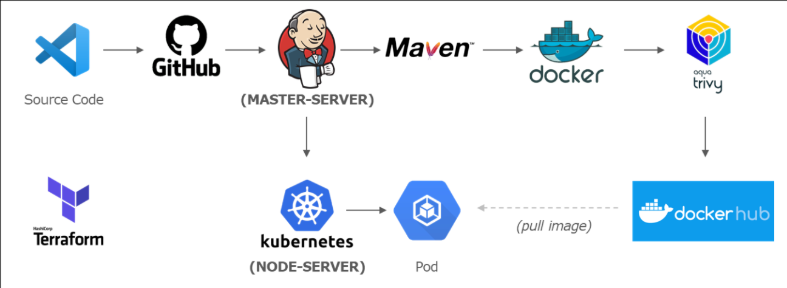

## Overview
The project sets up Jenkins and Kubernetes servers dynamically using Terraform. Post provisioning, these servers are configured using user-data scripts for automated setup. The CI/CD pipelines cover code building, testing, containerization, vulnerability scanning, and deployment.

## Key Features
- Dynamic server provisioning with Terraform.
- Secure server configuration, including SSH key-based authentication.
- Robust CI/CD pipeline implemented via Jenkins.
- Automated containerization and vulnerability scanning.
- Kubernetes-based deployment using Ansible.


## Tools Used

<a href="https://www.jenkins.io">
  
</a>  
<a href="https://code.visualstudio.com/">
  
</a>
<a href="https://git-scm.com/">
  
</a>
<a href="https://www.docker.com">
  
</a>  
<a href="https://kubernetes.io">
  
</a>  
<a href="https://www.kernel.org">
  
</a>  
<a href="https://www.terraform.io">
  
</a>
<a href="https://github.com">
  
</a>
<a href="https://github.com/tonistiigi/trivy">
  
</a>
<a href="https://aws.amazon.com/ec2">
  
</a>
<a href="https://www.ansible.com">
  
</a>
<a href="https://maven.apache.org">
  
</a>


**Jenkins**  **Docker** **Terraform** **Git** **Trivy** **AWS EC2** **Maven** **Ansible** **Kubernetes**
**Linux**

## Server Configuration
After provisioning Jenkins and Kubernetes servers using Terraform:

- **Jenkins server configuration** is written in `app-install.tpl` (user-data).
- **Kubernetes server configuration** is written in `k8s-install.tpl` (user-data).
- The Terraform files contain dynamic code to launch the Kubernetes and Jenkins servers.

### Commands to Run Terraform Code
1. Initialize AWS cloud provider:
   ```bash
   terraform init
   ```
2. Validate the syntax of Terraform code:
   ```bash
   terraform validate
   ```
3. Format Terraform code:
   ```bash
   terraform fmt
   ```
4. Dry run:
   ```bash
   terraform plan
   ```
5. Apply changes:
   ```bash
   terraform apply --auto-approve
   ```
6. Destroy resources:
   ```bash
   terraform destroy --auto-approve
   ```

## Steps to Set Up the Servers

### 1. Set Root Password on Both Servers
1. Switch to the root user:
   ```bash
   sudo su
   ```
2. Configure the `/etc/ssh/sshd_config` file to enable root login and password authentication:
   ```bash
   #!/bin/bash

   # File path
   SSH_CONFIG_FILE="/etc/ssh/sshd_config"

   # Backup the original file
   cp "$SSH_CONFIG_FILE" "${SSH_CONFIG_FILE}.bak"

   # Enable root login
   sed -i 's/^#?PermitRootLogin .*/PermitRootLogin yes/' "$SSH_CONFIG_FILE"

   # Enable password authentication
   sed -i 's/^#?PasswordAuthentication .*/PasswordAuthentication yes/' "$SSH_CONFIG_FILE"

   # Restart the SSHD service
   systemctl restart sshd

   echo "Root login and password authentication enabled. SSH service restarted."
   ```
3. Make the script executable and run it:
   ```bash
   chmod +x enable_root_login.sh
   sudo ./enable_root_login.sh
   ```
4. Set the root password:
   ```bash
   passwd root
   ```

### 2. Copy SSH Authentication Key from Jenkins Server to Kubernetes Server
1. Generate an SSH key pair on the Jenkins server:
   ```bash
   ssh-keygen
   ```
2. Copy the key to the Kubernetes server:
   ```bash
   ssh-copy-id root@<k8s-server-private-ip>
   ```
3. Verify the key on the Kubernetes server:
   ```bash
   ls ~/.ssh/
   ```

## System Verification Commands
To verify that all required packages and services are installed and running, use the following commands:

```bash
# Check Ansible version
ansible --version

# Check Java version
java -version

# Check Maven version
mvn -version

# Check Trivy version
trivy --version

# Check Docker version
docker --version

# Check git version
git --version

# Check Jenkins service status
systemctl status jenkins.service
```

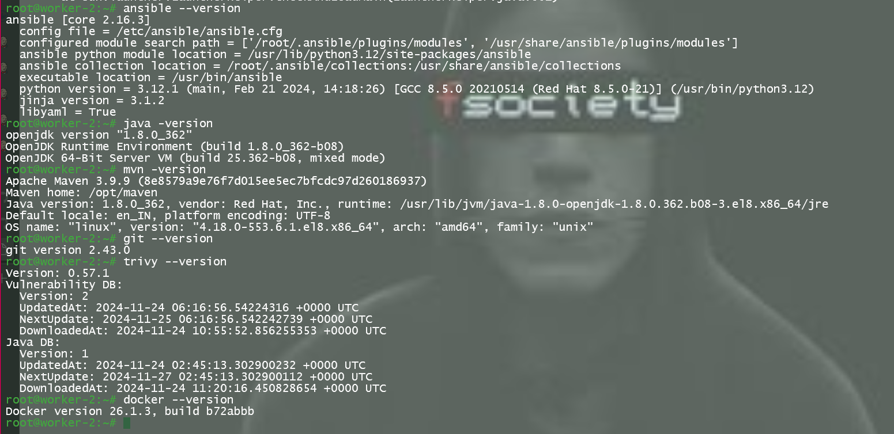
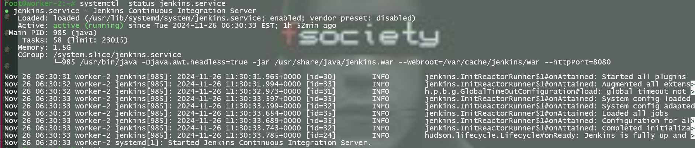
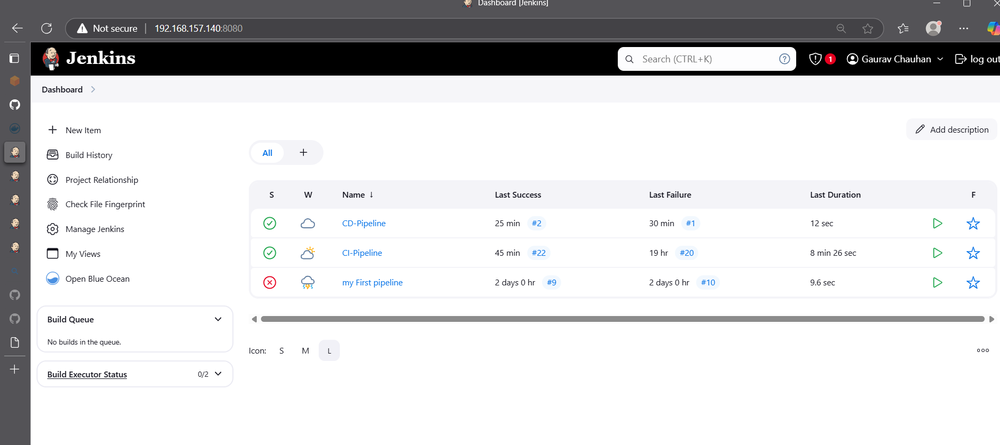

## Jenkins Configuration

### 1. Access Jenkins
1. Retrieve the Jenkins initial admin password:
   ```bash
   sudo cat /var/lib/jenkins/secrets/initialAdminPassword
   ```
2. Access Jenkins via `http://<public-ip-Jenkins-Server>:8080` and complete the setup wizard.

### 2. Configure Credentials
1. **Docker Hub Credentials**:
   - Manage Jenkins > Credentials > System > Global > Add Credentials.
   - Kind: Username with password.
   - ID: `hub-creds`.

2. **EC2 PEM Key**:
   - Kind: SSH Username with private key.
   - ID: `ec2_user`.

3. **GitHub Credentials**:
   - Generate a GitHub Personal Access Token with required scopes.
   - Save it in Jenkins credentials as `secret text`.
   - 
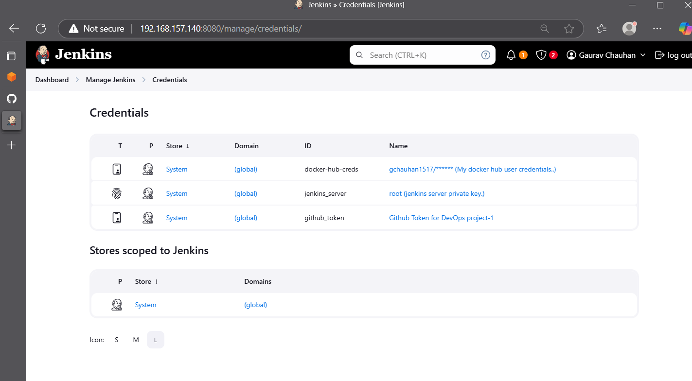

## Kubernetes clusture
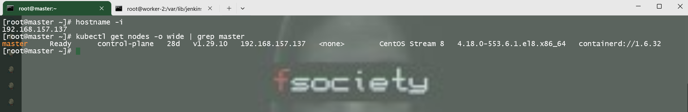

## CI/CD Pipeline

### CI Pipeline Stages: (Refer to `Jenkinsfiles/Jenkinsfile-CI`)
1. **Cleanup**: Remove existing artifacts.
2. **Git Checkout**: Clone source code from the Git repository.
3. **Maven Unit Testing**: Run tests using `pom.xml`.
4. **Maven Build**: Package code into a `.jar` file.
5. **Maven Integration Testing**: Ensure functionality between components.
6. **Docker Build**: Build a Docker image from the `.jar` file using `Dockerfile`.
7. **Scan Image**: Use Trivy to scan the Docker image for vulnerabilities.
8. **Docker Tag**: Tag the Docker image with `username/project-name:version-tag`.
9. **Docker Login & Push**: Push the Docker image to Docker Hub.

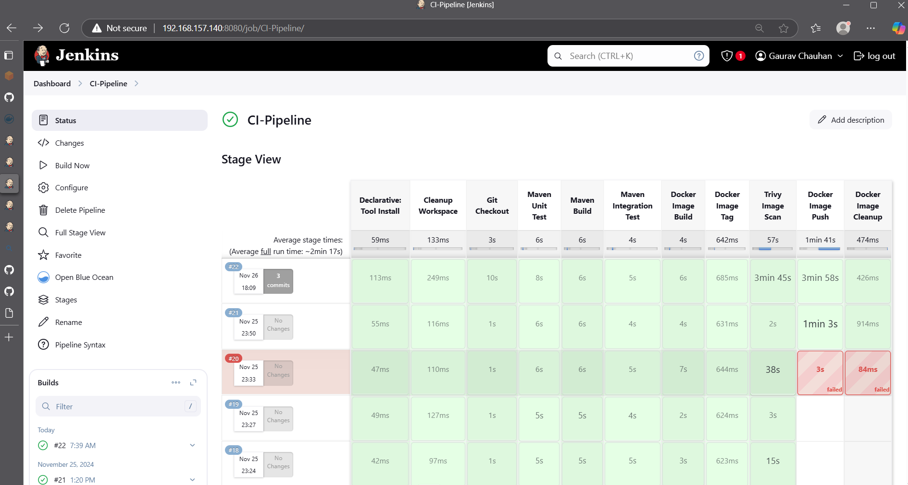
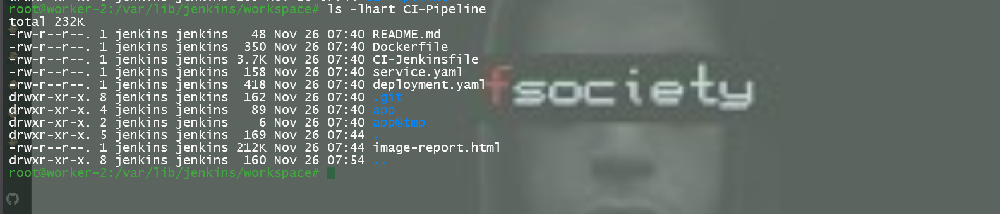
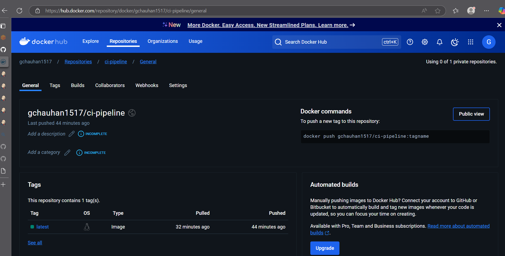


### CD Pipeline Stages: (Refer to `Jenkinsfiles/Jenkinsfile-CD`)
1. **Pull Files**:Copy Kubernetes manifest files from Jenkins workspace to the node server.
2. **Manual Approval**: If 'manual approval' is required, then it is called 'Continuous Delivery'.
   If it is totally automated, then it is called 'Continuous Deployment
3. **Deployment**: Deploy Kubernetes resources using Ansible.
   - Ensure passwordless SSH is set up between the master and node.
   - Use a `deployment.yaml` file containing the Docker Hub image in the container block.

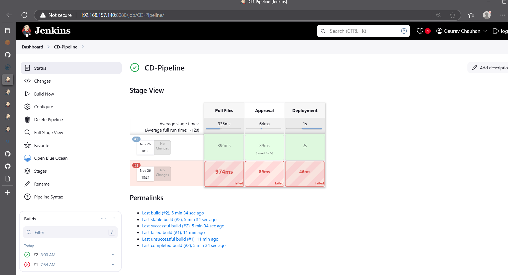
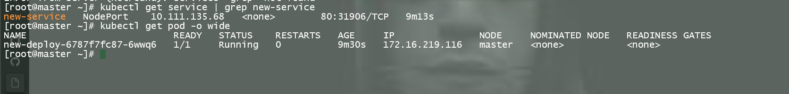
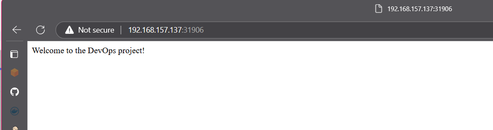

## Additional Notes
- Ensure the Kubernetes cluster is configured using Terraform.
- Set up SSH key-based authentication between Jenkins and Kubernetes servers.
- Configure Jenkins to trigger builds automatically via GitHub Webhooks.
- Follow security best practices for credential management.

## Highlights
- Implements best practices for DevOps pipelines.
- Fully automated setup and deployment processes.
- Uses Terraform for infrastructure provisioning and Ansible for configuration management.
- Leverages Docker and Kubernetes for scalable and portable application deployments.

This project is a complete solution for organizations looking to implement automated DevOps pipelines using modern tools and technologies.

