#  AWS 3 tier application deployment Project

In this architecture, a public-facing Application Load Balancer forwards client traffic to our web tier EC2 instances. The web tier is running Nginx webservers that are configured to serve a React.js website and redirects our API calls to the application tier’s internal facing load balancer. The internal facing load balancer then forwards that traffic to the application tier, which is written in Node.js. The application tier manipulates data in an Aurora MySQL multi-AZ database and returns it to our web tier. Load balancing, health checks and autoscaling groups are created at each layer to maintain the availability of this architecture.

# Architecture Diagram
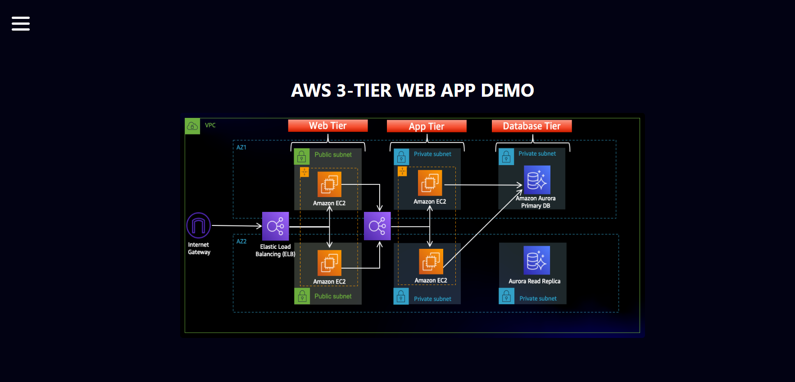

## Part 0: Setup
For this workshop, we will be downloading the code from Github and upload it to S3 so our instances can access it. We will also create an AWS Identity and Access Management EC2 role so we can use AWS Systems Manager Session Manager to connect to our instances securely and without needing to create SSH key pairs.

Learning Objectives:

•	S3 Bucket Creation
•	IAM EC2 Instance Role Creation
•	Download Code from Github Repository
Download Code from Github
Download the code from this repository  into your local environment by running the command below. If you don't have git installed, you can just download the zip. Save it somewhere you can easily access.
git clone https://github.com/aws-samples/aws-three-tier-web-architecture-workshop.git
S3 Bucket Creation
1.	Navigate to the S3 service in the AWS console and create a new S3 bucket.
2.	Give it a unique name, and then leave all the defaults as in. Make sure to select the region that you intend to run this whole lab in. This bucket is where we will upload our code later.
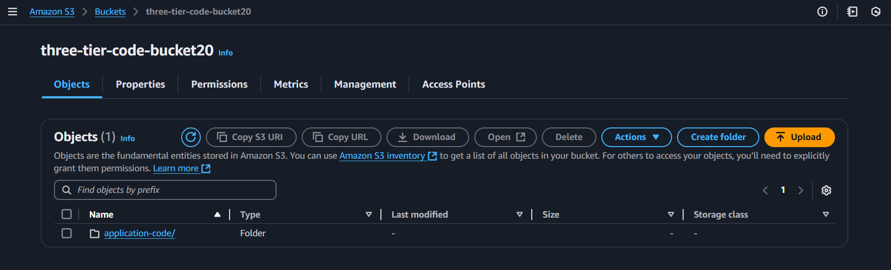

Same as above Create S3 bucket 2 for VPC flow logs. 
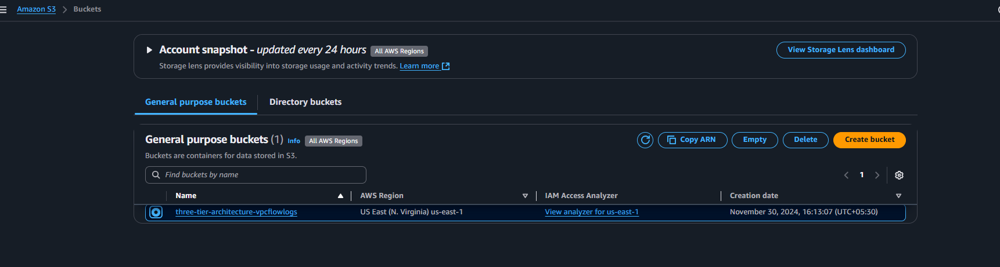

IAM EC2 Instance Role Creation
1.	Navigate to the IAM dashboard in the AWS console and create an EC2 role.
2. Select EC2 as the trusted entity.
3.	When adding permissions, include the following AWS managed policies. You can search for them and select them. These policies will allow our instances to download our code from S3 and use Systems Manager Session Manager to securely connect to our instances without SSH keys through the AWS console.
o	AmazonSSMManagedInstanceCore
o	AmazonS3ReadOnlyAccess
4.	Give your role a name, and then click Create Role.
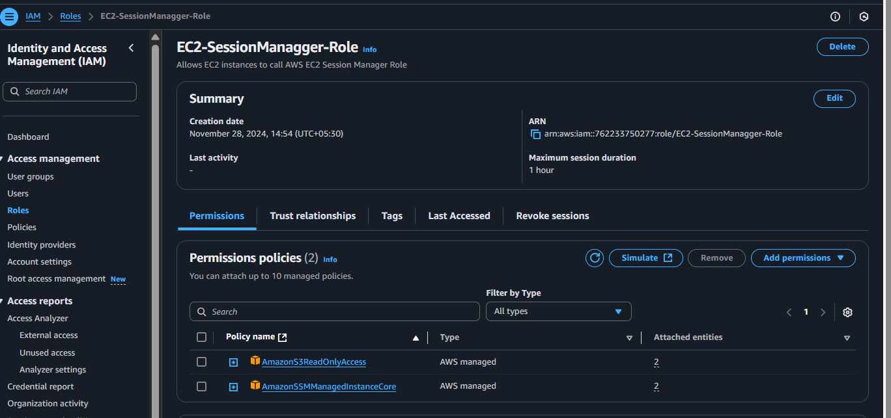

## Part 1: Networking and Security
In this section we will be building out the VPC networking components as well as security groups that will add a layer of protection around our EC2 instances, Aurora databases, and Elastic Load Balancers.

Learning Objectives:

•	Create an isolated network with the following components:
o	VPC
o	Subnets
o	Route Tables
o	Internet Gateway
o	NAT gateway
o	Security Groups

## VPC and Subnets
1.	VPC Creation
 1.	Navigate to the VPC dashboard in the AWS console and navigate to Your VPCs on the left hand side.
 2.	Make sure VPC only is selected, and fill out the VPC Settings with a Name tag and a CIDR range of your choice.
   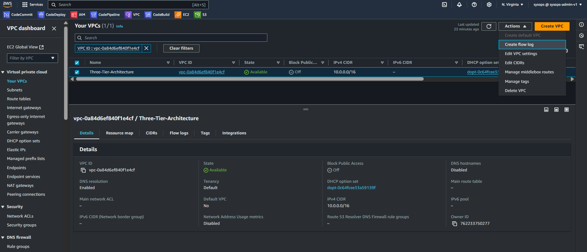
  NOTE: Make sure you pay attention to the region you’re deploying all your resources in. You’ll want to stay consistent for this workshop.
  NOTE: Choose a CIDR range that will allow you to create at least 6 subnets

2.	Subnet Creation
  1.	Next, create your subnets by navigating to Subnets on the left side of the dashboard and clicking Create subnet.
  2.	We will need six subnets across two availability zones. That means that three subnets will be in one availability zone,         and three subnets will be in another zone. Each subnet in one availability zone will correspond to one layer of our three       tier architecture. Create each of the 6 subnets by specifying the VPC we created in part 1 and then choose a name,               availability zone, and appropriate CIDR range for each of the subnets.
  NOTE: It may be helpful to have a naming convention that will help you remember what each subnet is for. For example in one     AZ you might have the following: Public-Web-Subnet-AZ-1, Private-App-Subnet-AZ-1, Private-DB-Subnet-AZ-1.
  NOTE: Remember, your CIDR range for the subnets will be subsets of your VPC CIDR range.
  Your final subnet setup should be similar to this. Verify that you have 3 subnets across 2 different availability zones.
  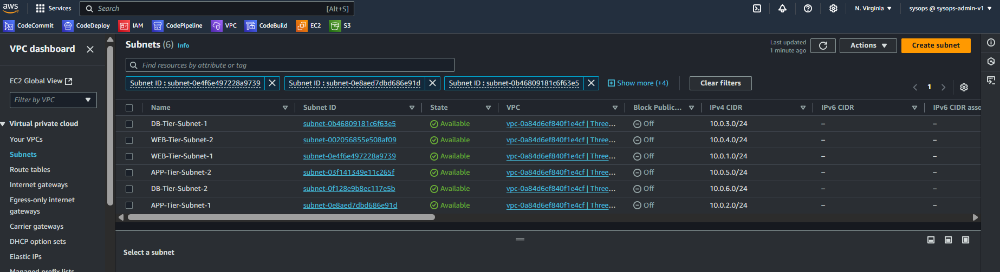

Internet Connectivity
1.	Internet Gateway
  1.	In order to give the public subnets in our VPC internet access we will have to create and attach an Internet Gateway. On the left hand side of the VPC dashboard, select Internet Gateway.
  2.	Create your internet gateway by simply giving it a name and clicking Create internet gateway.
  3.	After creating the internet gateway, attach it to your VPC that you create in the VPC and Subnet Creation step of the workshop. You have a couple options on how to do this, either with the creation success message or the Actions drop down.
  4.	Then, select the correct VPC and click Attach internet gateway.
     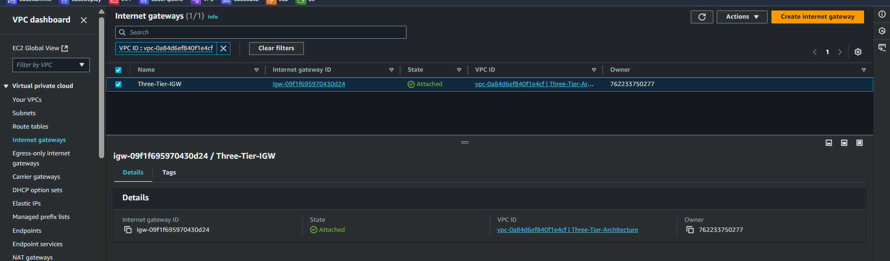

NAT Gateway
  1.	In order for our instances in the app layer private subnet to be able to access the internet they will need to go through a NAT Gateway. For high availability, you’ll deploy one NAT gateway in each of your public subnets. Navigate to NAT Gateways on the left side of the current dashboard and click Create NAT Gateway.
  2.	Fill in the Name, choose one of the public subnets you created in part 2, and then allocate an Elastic IP. Click Create NAT gateway.
  3.	Repeat step 1 and 2 for the other subnet.

NAT-1
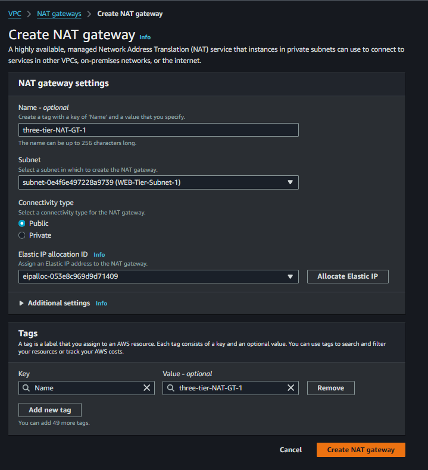
NAT-2
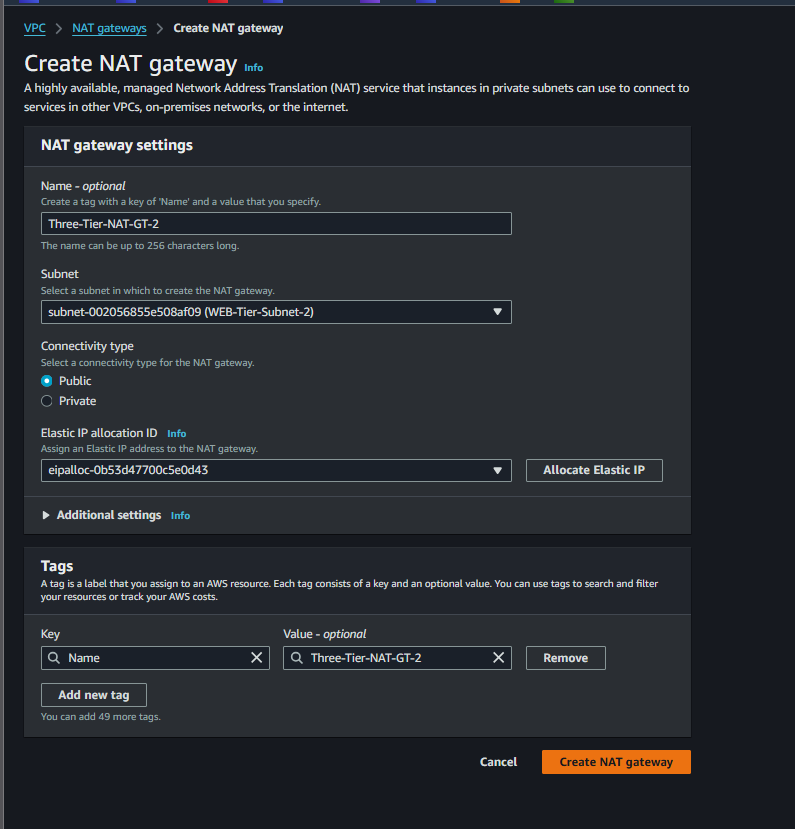

Routing Configuration
  1.	Navigate to Route Tables on the left side of the VPC dashboard and click Create route table First, let’s create one route table for the web layer public subnets and name it accordingly.
  2.	After creating the route table, you'll automatically be taken to the details page. Scroll down and click on the Routes tab and Edit routes.
   3.	Add a route that directs traffic from the VPC to the internet gateway. In other words, for all traffic destined for IPs outside the VPC CDIR range, add an entry that directs it to the internet gateway as a target. Save the changes.
   4.	Edit the Explicit Subnet Associations of the route table by navigating to the route table details again. Select Subnet Associations and click Edit subnet associations.
Select the two web layer public subnets you created eariler and click Save associations.
   5.	Now create 2 more route tables, one for each app layer private subnet in each availability zone. These route tables will route app layer traffic destined for outside the VPC to the NAT gateway in the respective availability zone, so add the appropriate routes for that.
WEB-Tier-Subnet-Route-Flow
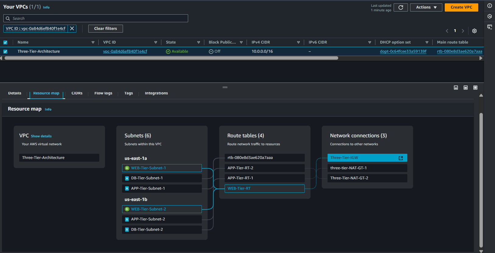
APP-Tier-Subnet-1-Route-Flow
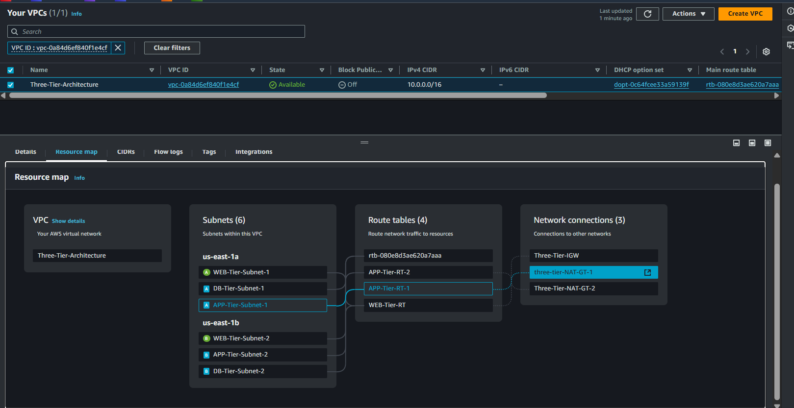
APP-Tier-Sbunet-2-Route-Flow
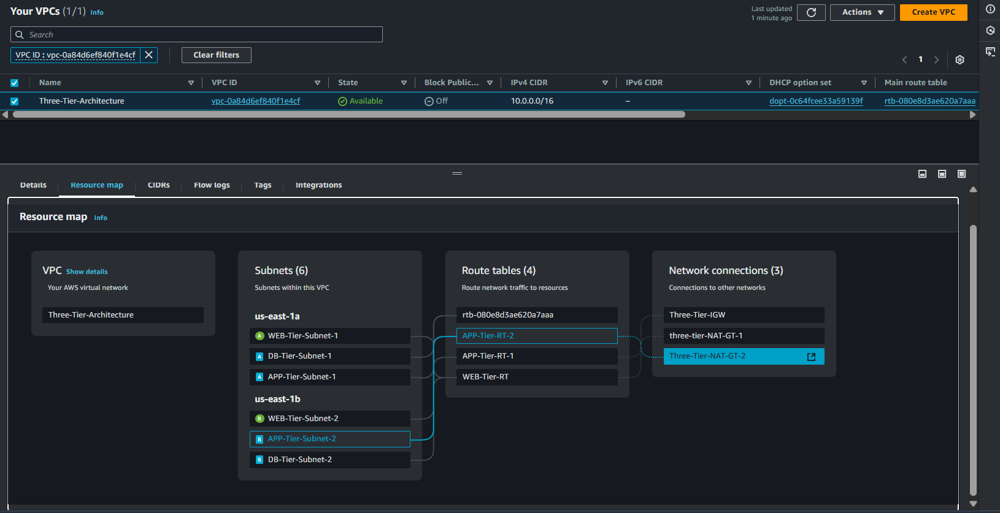

**Security Groups**
  1.	Security groups will tighten the rules around which traffic will be allowed to our Elastic Load Balancers and EC2 instances. Navigate to Security Groups on the left side of the VPC dashboard, under Security.
  2.	The first security group you’ll create is for the public, internet facing load balancer. After typing a name and description, add an inbound rule to allow HTTP type traffic for your IP.
  3.	The second security group you’ll create is for the public instances in the web tier. After typing a name and description, add an inbound rule that allows HTTP type traffic from your internet facing load balancer security group you created in the previous step. This will allow traffic from your public facing load balancer to hit your instances. Then, add an additional rule that will allow HTTP type traffic for your IP. This will allow you to access your instance when we test.
  4.	The third security group will be for our internal load balancer. Create this new security group and add an inbound rule that allows HTTP type traffic from your public instance security group. This will allow traffic from your web tier instances to hit your internal load balancer.
  5.	The fourth security group we’ll configure is for our private instances. After typing a name and description, add an inbound rule that will allow TCP type traffic on port 4000 from the internal load balancer security group you created in the previous step. This is the port our app tier application is running on and allows our internal load balancer to forward traffic on this port to our private instances. You should also add another route for port 4000 that allows your IP for testing.
  6.	The fifth security group we’ll configure protects our private database instances. For this security group, add an inbound rule that will allow traffic from the private instance security group to the MYSQL/Aurora port (3306).
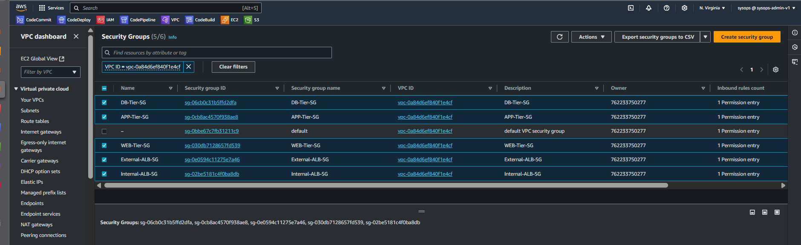

## Part 2: Database Deployment
This section of the workshop will walk you through deploying the database layer of the three tier architecture.

Learning Objectives:

•	Deploy Database Layer
o	Subnet Groups
o	Multi-AZ Database
Subnet Groups
1.	Navigate to the RDS dashboard in the AWS console and click on Subnet groups on the left hand side. Click Create DB subnet group.

    	
  
