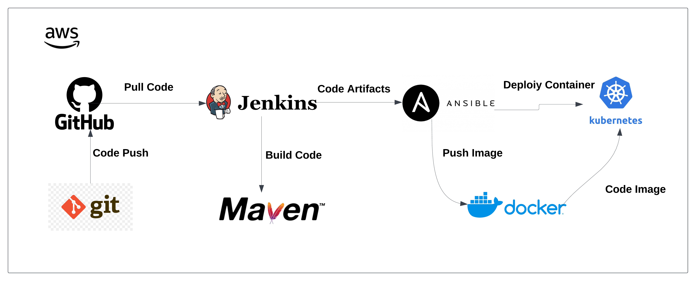

# Kubernetes CI/CD Integration Suite

## **Project Description: Building and Deploying Artifacts on Kubernetes**  

This project focuses on designing and implementing a CI/CD pipeline to build and deploy application artifacts on a Kubernetes cluster. The primary goal is to automate the entire process, starting from code integration to deployment on a scalable, fault-tolerant Kubernetes environment, leveraging the best practices of DevOps and cloud-native technologies.  

## **Architecture**:

## **Tool Used**:

### Key Highlights:
1. **CI/CD Integration**: The pipeline integrates tools like GitHub for version control, Jenkins for CI/CD orchestration, Maven for building artifacts, and Docker for containerization.  
2. **Kubernetes Deployment**: Applications are packaged and deployed as pods within a Kubernetes cluster, providing better scalability, reliability, and orchestration compared to traditional Docker hosts.  
3. **Kubernetes Setup**: The Kubernetes environment is manually set up to provide a robust infrastructure for deploying containerized applications, allowing fine-grained control over the cluster's configuration.  
4. **Infrastructure as Code**: Ansible playbooks are utilized for automating the setup of Kubernetes resources, including deployments and services, making the process repeatable and efficient.  
5. **Advantages over Docker-Only Deployments**: Unlike standalone Docker hosts, Kubernetes offers advanced features such as self-healing, load balancing, and rolling updates, ensuring high availability and minimal downtime for applications.  

This project demonstrates the seamless collaboration of CI/CD tools and container orchestration, resulting in a streamlined process for deploying and managing applications in a production-grade Kubernetes environment.
