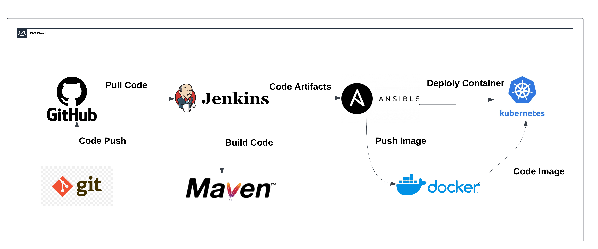

# Kubernetes CI/CD Integration Suite

## **Project Description: Building and Deploying Artifacts on Kubernetes**  

This project focuses on designing and implementing a CI/CD pipeline to build and deploy application artifacts on a Kubernetes cluster. The primary goal is to automate the entire process, starting from code integration to deployment on a scalable, fault-tolerant Kubernetes environment, leveraging the best practices of DevOps and cloud-native technologies.  

## **Architecture**:


## **Tool Used**:

<a href="https://aws.amazon.com">
  
</a>
<a href="https://www.kernel.org">
  
</a>
<a href="https://git-scm.com">
  
</a>
<a href="https://github.com">
  
</a>
<a href="https://www.jenkins.io">
  
</a>
<a href="https://maven.apache.org">
  
</a>
<a href="https://github.com/tonistiigi/trivy">
  
</a>
<a href="https://www.docker.com">
  
</a>
<a href="https://www.ansible.com">
  
</a>
<a href="https://kubernetes.io">
  
</a>


### Key Highlights:
1. **CI/CD Integration**: The pipeline integrates tools like GitHub for version control, Jenkins for CI/CD orchestration, Maven for building artifacts, and Docker for containerization.  
2. **Kubernetes Deployment**: Applications are packaged and deployed as pods within a Kubernetes cluster, providing better scalability, reliability, and orchestration compared to traditional Docker hosts.  
3. **Kubernetes Setup**: The Kubernetes environment is manually set up to provide a robust infrastructure for deploying containerized applications, allowing fine-grained control over the cluster's configuration.  
4. **Infrastructure as Code**: Ansible playbooks are utilized for automating the setup of Kubernetes resources, including deployments and services, making the process repeatable and efficient.  
5. **Advantages over Docker-Only Deployments**: Unlike standalone Docker hosts, Kubernetes offers advanced features such as self-healing, load balancing, and rolling updates, ensuring high availability and minimal downtime for applications.  


### Note: Setting Up Kubernetes Environment on AWS   

#### Here's a step-by-step guide to set up Jenkins, Maven, and Docker on the **main server** and Kubernetes on a **secondary machine**:

## **Main Server Setup: Jenkins, Java, Maven, Docker, Git, Ansible, Trivy**

### **1. Install Jenkins**  
1. Update the system and install Java:  
   ```bash
   # Update and install prerequisites
    sudo yum update -y
    sudo yum install -y curl tar gzip wget vim 
    
    # JDK 17 installation
    echo "Installing Amazon Corretto JDK 17..."
    
    # Import the Corretto GPG key
    sudo rpm --import https://yum.corretto.aws/corretto.key
    
    # Add the Corretto repository
    sudo curl -L -o /etc/yum.repos.d/corretto.repo https://yum.corretto.aws/corretto.repo
    
    # Install Java 17
    sudo yum install -y java-17-amazon-corretto
    
    # Setting up JDK environment variables
    echo "Configuring Java environment variables..."
    echo "export JAVA_HOME=/usr/lib/jvm/java-17-amazon-corretto" | sudo tee -a /etc/profile
    echo "export PATH=\$PATH:\$JAVA_HOME/bin" | sudo tee -a /etc/profile
    
    # Source the profile to ensure environment variables are loaded
    source /etc/profile
    
    # Verify Java installation
    java -version
   ```
  
  2. Add the Jenkins repository and key:  
   ```bash
   echo "Installing Jenkins..."
   sudo wget -O /etc/yum.repos.d/jenkins.repo https://pkg.jenkins.io/redhat-stable/jenkins.repo
   sudo rpm --import https://pkg.jenkins.io/redhat-stable/jenkins.io.key
   ```
3. Install Jenkins:  
   ```bash
    sudo yum upgrade -y
    sudo yum install jenkins -y
    sudo systemctl enable jenkins --now
   ```
4. Access Jenkins via `http://<server-ip>:8080` and complete the setup.

---

### **2. Install Docker**
1. Install Docker:
   ```bash
    echo "Installing Docker..."
    sudo yum update -y
    sudo yum install docker -y
    sudo systemctl enable docker --now

2. Add Jenkins user to the `docker` group:
   ```bash
   sudo usermod -aG docker jenkins
   # To avoid permission denied while connecting to Docker socket
   sudo chmod 666 /var/run/docker.sock
   ```
3. Restart & verify jenkins service.
   ```bash
   sudo systemctl restart jenkins
   sudo systemctl status jenkins
   ```
   
### **3. Install Maven**
1. Install Maven using the package manager:
   ```bash
    echo "Downloading and installing Maven 3.9.9..."
    sudo wget https://dlcdn.apache.org/maven/maven-3/3.9.9/binaries/apache-maven-3.9.9-bin.tar.gz -P /tmp
    sudo tar -xzf /tmp/apache-maven-3.9.9-bin.tar.gz -C /opt
    ```
   
2. Create a symbolic link for Maven (optional, but recommended)
   ```bash
    sudo ln -s /opt/apache-maven-3.9.9 /opt/maven
    ```
   
3.  Configure environment variables for Maven
   ```bash
    sudo tee /etc/profile.d/maven.sh > /dev/null <<EOL
    # Apache Maven Environment Variables
    export JAVA_HOME=/usr/lib/jvm/java-17-amazon-corretto
    export M2_HOME=/opt/maven
    export MAVEN_HOME=/opt/maven
    export PATH=\${M2_HOME}/bin:\${PATH}
    EOL 
   ```

4. Modify file permissions for the Maven configuration script
   ```bash
    sudo chmod +x /etc/profile.d/maven.sh
   ```
    
5. Source the Maven configuration script to apply changes
  ```bash
    source /etc/profile.d/maven.sh
  ```
    
6.  Verify Maven installation
  ```bash
    mvn -version
  ```
    
### **4. Git Installation**
  ```bash
    sudo yum install -y git*
  ```

#4.1 If get error to install git . 
  ```bash
   sudo yum install git* -y --skip-broken
   ```

### **5. Install Trivy**
  ```bash
    echo "Installing Trivy..."
    # Add Trivy repository
    cat << EOF | sudo tee /etc/yum.repos.d/trivy.repo
    [trivy]
    name=Trivy repository
    baseurl=https://aquasecurity.github.io/trivy-repo/rpm/releases/\$basearch/
    gpgcheck=1
    enabled=1
    gpgkey=https://aquasecurity.github.io/trivy-repo/rpm/public.key
    EOF
    
    # Update the package list
    sudo yum -y update
    
    # Install Trivy
    sudo yum -y install trivy
    
    # Verify installation
    echo "Verify trivy installation."
    trivy --version
  ```

## **Install Ansible and Dependencies**

  ```bash
    echo "Installing Ansible and dependencies..."
    # Install Python 3, python-devel, python3-pip, and OpenSSL
    echo "Installing Python 3, python-devel, python3-pip, and OpenSSL..."
    sudo yum install -y python3 python3-devel python3-pip openssl
    
    # Install Ansible
    echo "Installing Ansible..."
    sudo amazon-linux-extras install ansible2 -y
    
    # Verify installations
    echo "Verifying installations..."
    python3 --version
    pip3 --version
    ansible --version
  ```

## **Secondary Machine Setup: Kubernetes**

### **1. Install Kubernetes Tools (kubectl, kubeadm, kubelet)**

# Install Docker
  ```bash
    # REF: https://docs.aws.amazon.com/eks/latest/userguide/install-kubectl.html
    sudo yum update -y
    sudo yum install -y docker
    sudo systemctl start docker
    sudo systemctl enable docker
    sudo chmod 777 /var/run/docker.sock
  ```
    
# Install Kubernetes components
```bash
    # REF: https://kubernetes.io/docs/setup/production-environment/tools/kubeadm/install-kubeadm/
    sudo setenforce 0
    sudo sed -i 's/^SELINUX=enforcing/SELINUX=permissive/' /etc/selinux/config
```
    
 ## Add Kubernetes repository
```bash
    cat <<EOF | sudo tee /etc/yum.repos.d/kubernetes.repo
    [kubernetes]
    name=Kubernetes
    baseurl=https://pkgs.k8s.io/core:/stable:/v1.29/rpm/
    enabled=1
    gpgcheck=1
    gpgkey=https://pkgs.k8s.io/core:/stable:/v1.29/rpm/repodata/repomd.xml.key
    EOF
```

## Install kubelet, kubeadm, and kubectl
```bash
    sudo yum install -y kubelet kubeadm kubectl --disableexcludes=kubernetes
    sudo systemctl enable --now kubelet
```
    
## Initialize Kubernetes cluster
```bash
    sudo kubeadm init --pod-network-cidr=10.244.0.0/16 --ignore-preflight-errors=NumCPU,Mem
```
    
## Configure kubectl for the root user
```bash
    mkdir -p $HOME/.kube
    sudo cp /etc/kubernetes/admin.conf $HOME/.kube/config
    sudo chown $(id -u):$(id -g) $HOME/.kube/config
```
    
## Deploy Calico network plugin
```bash
    kubectl apply -f https://docs.projectcalico.org/v3.18/manifests/calico.yaml
    
    # Deploy Tigera Operator (optional)
    kubectl apply -f https://raw.githubusercontent.com/projectcalico/calico/v3.27.0/manifests/tigera-operator.yaml
 ```   
## Remove taints from control-plane nodes (allow workloads on the master node)
```bash
    kubectl taint nodes $(hostname) node-role.kubernetes.io/control-plane:NoSchedule-
  ```

### Add Worker Nodes**
1. On worker nodes, join the cluster using the command provided during `kubeadm init`:
   ```bash
   sudo kubeadm join <master-ip>:6443 --token <token> \
   --discovery-token-ca-cert-hash sha256:<hash>
   ```

---

###  Verify Kubernetes Cluster**
1. Check nodes:
   ```bash
   kubectl get nodes
   ```
2. Ensure all pods are running:
   ```bash
   kubectl get pods -A
   ```

---


T
