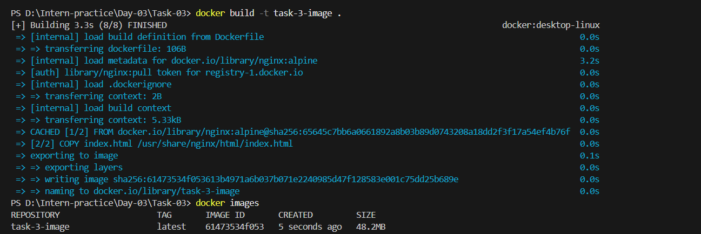
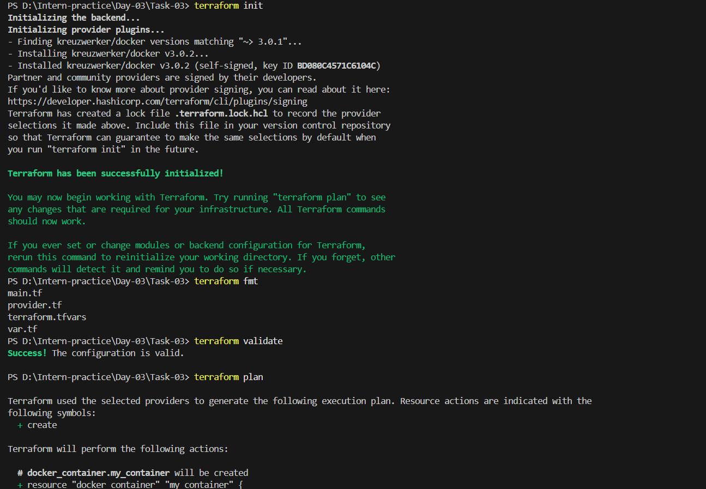
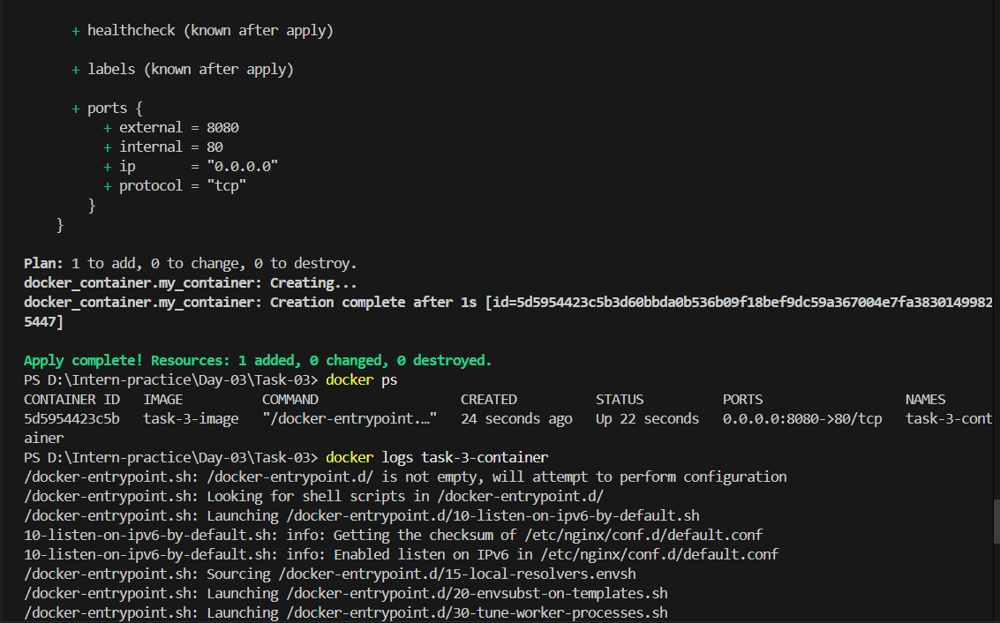
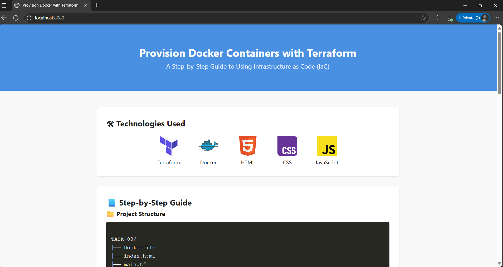

# 🚀 TASK-03: Provision Local Docker Container using Terraform

This project demonstrates how to:
- Install Terraform on Windows
- Create a custom Docker image with NGINX
- Use Terraform to provision a Docker container
- Serve a static website using `nginx:alpine`

---

## 🛠 Prerequisites

- [Terraform](https://developer.hashicorp.com/terraform/install)
- Docker Desktop installed and running

---

## ✅ 1. Install Terraform on Windows

### 🔽 Download

- Version: **1.12.1**
- Architecture: **AMD64**
- Download from: [Terraform Windows Installer](https://developer.hashicorp.com/terraform/install)

### 📦 Extract & Set Up

1. Extract ZIP using 7zip, WinRAR, etc.
2. Create a folder:  
   `C:\Program Files\Terraform`
3. Move the Terraform binary (`terraform.exe`) to this folder.

### 🛠 Add to Environment Variables

1. Press `Windows + S` and search for **Environment Variables**
2. Click **Edit the system environment variables**
3. Click **Environment Variables**
4. Under **System Variables**, find `Path` → Edit → New
5. Add:  
   `C:\Program Files\Terraform`
6. Click **OK** in all windows

### ✅ Verify

Open a new **Command Prompt** and run:

```bash
terraform --version
````

---

## 🌐 2. Create a Static Website

Create an `index.html` file:

```html
<h1>Hello from Terraform Docker NGINX!</h1>
```

---

## 🐳 3. Dockerfile

Create a `Dockerfile`:

```dockerfile
FROM nginx:alpine
COPY index.html /usr/share/nginx/html/index.html
```

### 🔧 Build Docker Image

```bash
docker build -t task-3-image .
```

### 🔍 Verify Image

```bash
docker images | findstr "task-3-image"
```

Expected output:

```
task-3-image    latest   61473534f053   48.2MB
```

---

## 🧱 4. Terraform Configuration

### 📄 provider.tf

```hcl
terraform {
  required_providers {
    docker = {
      source  = "kreuzwerker/docker"
      version = "~> 3.0.1"
    }
  }
}

provider "docker" {
  host = "npipe:////.//pipe//docker_engine"
}
```

### 📄 main.tf

```hcl
resource "docker_container" "my_container" {
  image = var.image_name
  name  = var.container_name

  ports {
    internal = var.internal_port
    external = var.external_port
  }
}
```

### 📄 var.tf

```hcl
variable "image_name" {
  description = "Name of the local Docker image"
  type        = string
  default     = "task-3-image"
}

variable "container_name" {
  description = "Name of Docker container"
  type        = string
  default     = "custom-nginx-container"
}

variable "internal_port" {
  description = "Port inside the container"
  type        = number
  default     = 80
}

variable "external_port" {
  description = "Port on host machine"
  type        = number
  default     = 8080
}
```

### 📄 terraform.tfvars

```hcl
image_name     = "task-3-image"
container_name = "task-3-container"
internal_port  = 80
external_port  = 8080
```

---

## ⚙️ 5. Run Terraform Commands

```bash
# Step 1: Initialize Terraform
terraform init

# Step 2: Format Terraform files
terraform fmt

# Step 3: Validate Terraform configuration
terraform validate

# Step 4: Preview the plan
terraform plan

# Step 5: Apply the configuration (auto-approve)
terraform apply --auto-approve
```


---

## 🧼 6. Cleanup

To destroy the container:

```bash
terraform destroy --auto-approve
```

---

## 🔎 7. Verify & Browse

Check running containers:

```bash
docker ps
```
To check the logs of container

```bash
docker logs <container-name>
```


Open your browser:

```
http://localhost:8080 

```



Happy Automating! 🚀


